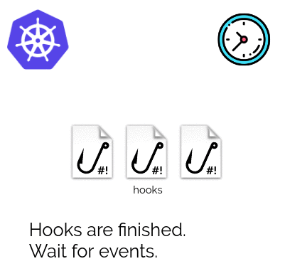
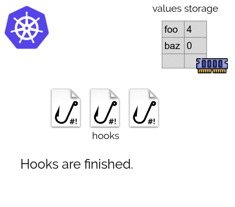
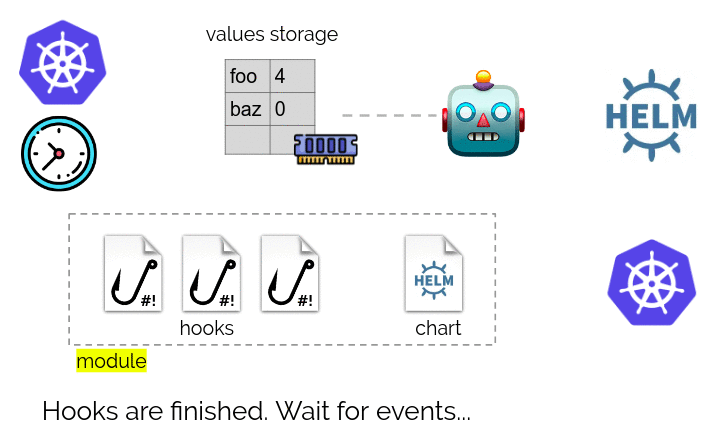
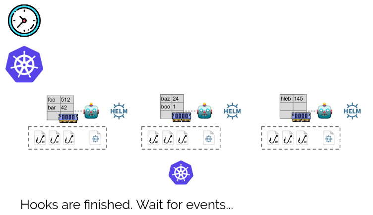
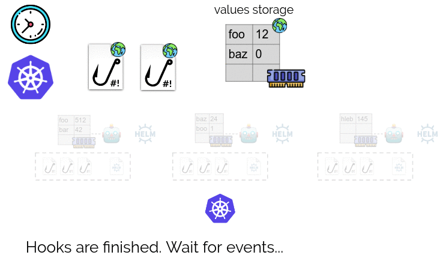
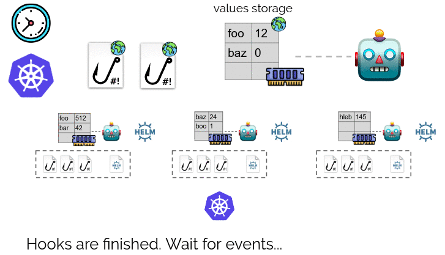

**Addon-operator** combines Helm charts with hooks and values storage to transform charts into smart modules that configure themselves and respond to changes in the cluster. It is a sister project for [shell-operator](https://github.com/flant/shell-operator) and is actively used in [Deckhouse Kubernetes Platform](https://github.com/deckhouse/deckhouse) to implement its modules.

**Contents**

* [Features](#features)
* [Overview](#overview)
  * [Hooks and Helm values](#hooks-and-helm-values)
  * [Modules](#modules)
* [Installation](#installation)
  * [Examples](#examples)
* [What's next?](#whats-next)
* [Community](#community)
* [License](#license)

# Features

- **Discovery of values** for Helm charts — parameters can be generated, calculated or retrieved from the cluster;
- **Continuous discovery** — parameters can be changed in response to cluster events;
- **Controlled Helm execution** — addon-operator monitors the Helm operation to ensure the Helm chart’s successful installation. Coming soon: use kubedog to track deploy status and more;
- **Custom extra actions before and after running Helm** as well as any other events via the hooks paradigm. See related [shell-operator capabilities](https://github.com/flant/shell-operator/blob/master/HOOKS.md).

Additionally, addon-operator provides:

- ease of maintenance of Kubernetes clusters: use the tools that Ops are familiar with to build your modules and hooks such as Bash, kubectl, Python, etc;
- the execution queue of modules and hooks that ensures the launch sequence and repeated execution in case of an error, which *simplifies programming of modules* and ensures *predictable outcome* of their operation;
- the possibility of *dynamic enabling/disabling* of a module (depending on detected parameters);
- the ability to tie *conditions of module activation* to the activation of other modules;
- *the unified ConfigMap* for the configuration of all settings;
- the ability to run Helm only if parameters have changed. In this case, `helm history` would output only releases with changes;
- *global hooks* for figuring out parameters and performing actions that affect several dependent modules;
- off-the-shelf *metrics* for monitoring via Prometheus.

# Overview

## Hooks and Helm values

Hooks are triggered by Kubernetes events and in response to other stimuli.

A hook is an executable file that can make changes to Kubernetes and set values of Helm (they are stored in the memory of addon-operator) during execution.

Hooks are a part of the module. Also, there is a Helm chart in the module. If the hook makes changes to values, then addon-operator would upgrade the release of the Helm chart.

## Modules

There can be many modules.

In addition to modules, addon-operator supports **global hooks** and **global values**. They have a **storage of values**. Global hooks are triggered by events and when active they can:

- Make changes to Kubernetes cluster;
- Make changes to global values storage.

If the global hook changes values in the global storage, then addon-operator triggers an upgrade of releases of all Helm charts.

# Installation

You may use a prepared image [flant/addon-operator](https://hub.docker.com/r/flant/addon-operator) to install addon-operator in a cluster. The image comprises a binary `addon-operator` file as well as several required tools: `helm`, `tiller`, `kubectl`, `jq`, `bash`.

The installation incorporates the image building process with *files of modules and hooks*, applying the necessary RBAC rights and deploying the image in the cluster.

## Examples

To experiment with modules, hooks, and values we've prepared some [examples](/examples).

[Deckhouse Kubernetes Platform](https://deckhouse.io/) was an initial reason to create addon-operator, thus [its modules](https://github.com/deckhouse/deckhouse/tree/main/modules) might become a vital source of inspiration for implementing your own modules.

Sharing your examples of using addon-operator is much appreciated. Please, use the [relevant Discussions section](https://github.com/flant/addon-operator/discussions/categories/show-and-tell) for that.

# What's next?

- Find out more on [lifecycle](LIFECYCLE.md) of addon-operator and how to use [modules](MODULES.md), [hooks](HOOKS.md) and [values](VALUES.md).
- See [METRICS](METRICS.md) on how to monitor addon-operator.
- Explore [shell-operator](https://github.com/flant/shell-operator) documentation, especially its [hooks](https://github.com/flant/shell-operator/blob/master/HOOKS.md) section.
- Discover how to tune [deploy settings](RUNNING.md).

# Community

Please feel free to reach developers/maintainers and users via [GitHub Discussions](https://github.com/flant/addon-operator/discussions) for any questions regarding addon-operator.

You're also welcome to follow [@flant_com](https://twitter.com/flant_com) to stay informed about all our Open Source initiatives.

# License

Apache License 2.0, see [LICENSE](LICENSE).
