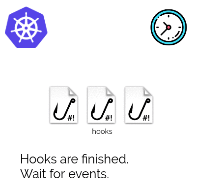
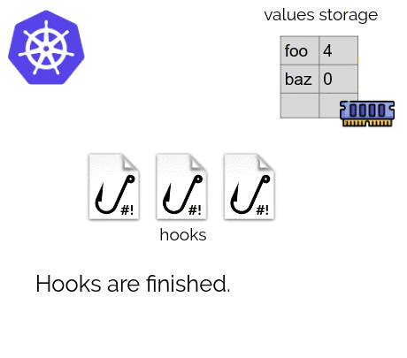
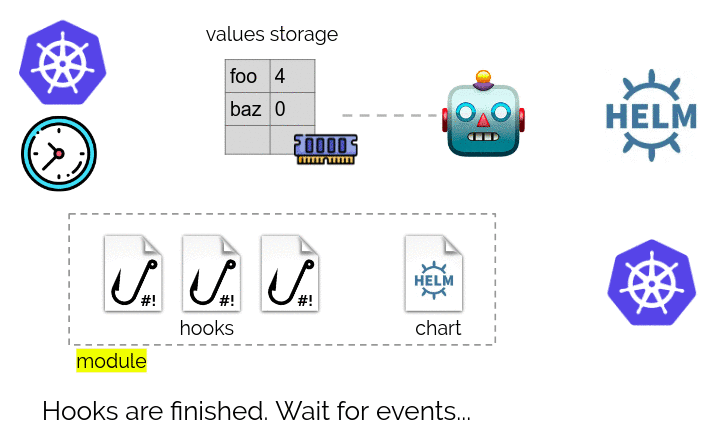
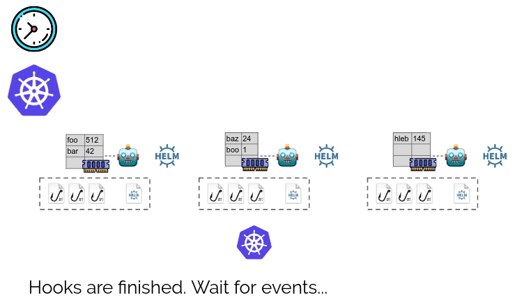
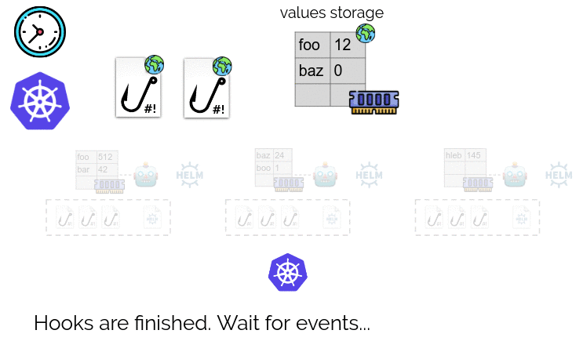

# Overview

**Addon-operator** combines Helm charts with hooks and values storage to transform charts into smart modules that configure themselves and respond to changes in the cluster. It is a sister project for [shell-operator][shell-operator] and is actively used in [Deckhouse Kubernetes Platform][deckhouse] to implement its modules.

## Features

- **Discovery of values** for Helm charts — parameters can be generated, calculated or retrieved from the cluster;
- **Continuous discovery** — parameters can be changed in response to cluster events;
- **Controlled Helm execution** — addon-operator monitors the Helm operation to ensure the Helm chart’s successful installation. Coming soon: use kubedog to track deploy status and more;
- **Custom extra actions before and after running Helm** as well as any other events via the hooks paradigm. See related [shell-operator capabilities][shell-operator-hooks].

Additionally, addon-operator provides:

- ease of maintenance of Kubernetes clusters: use the tools that Ops are familiar with to build your modules and hooks such as Bash, kubectl, Python, etc;
- the execution queue of modules and hooks that ensures the launch sequence and repeated execution in case of an error, which *simplifies programming of modules* and ensures *predictable outcome* of their operation;
- the possibility of *dynamic enabling/disabling* of a module (depending on detected parameters);
- the ability to tie *conditions of module activation* to the activation of other modules;
- *the unified ConfigMap* for the configuration of all settings;
- the ability to run Helm only if parameters have changed. In this case, `helm history` would output only releases with changes;
- *global hooks* for figuring out parameters and performing actions that affect several dependent modules;
- off-the-shelf *metrics* for monitoring via Prometheus.

## Hooks and Helm values

Hooks are triggered by Kubernetes events and in response to other stimuli.

A hook is an executable file that can make changes to Kubernetes and set values of Helm (they are stored in the memory of addon-operator) during execution.

Hooks are a part of the module. Also, there is a Helm chart in the module. If the hook makes changes to values, then addon-operator would upgrade the release of the Helm chart.

## Modules

There can be many modules.

In addition to modules, addon-operator supports **global hooks** and **global values**. They have a **storage of values**. Global hooks are triggered by events and when active they can:

- Make changes to Kubernetes cluster;
- Make changes to global values storage.

If the global hook changes values in the global storage, then addon-operator triggers an upgrade of releases of all Helm charts.

[deckhouse]: https://github.com/deckhouse/deckhouse
[shell-operator]: https://github.com/flant/shell-operator
[shell-operator-hooks]: https://flant.github.io/shell-operator/HOOKS.html
